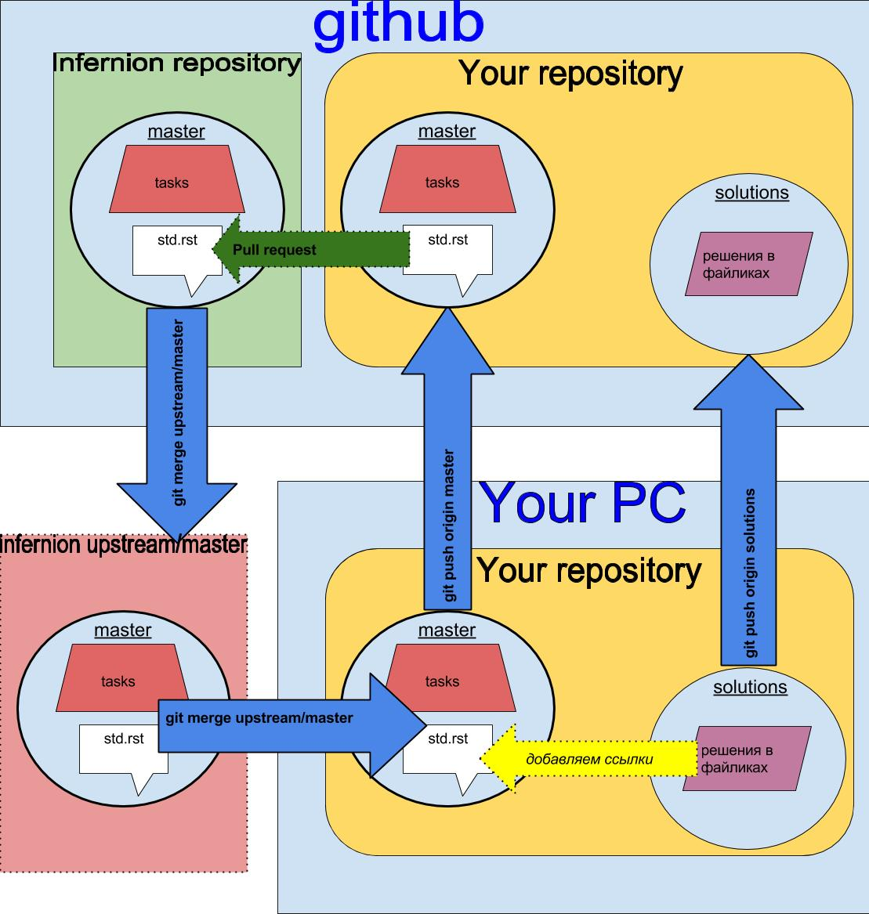

************
python_learn
************
Изучение Python в группе. Успеваемость по ссылке scores_

В дальнейшем мы будем работать через GitHub. Предполагается что вы используете Linux_. Также можно PyCharm_.
Обучалки: PyCharm_Edu_, Codecadame_, Prometheus_.

Помощь
=====
Как установить Linux? HL_

Как установить Git? HG_

Как работать с репозиториями? HR_

Как рабоать с табличкой? HT_

Instructions_

Общая схема работы с GitHub
===========================

Если что-то не ясно переходим по ссылочке для коментариев: for_comments_. Сюда можно задавать вопросы, с указанием на
процесс.

.. Links
.. _table: https://github.com/Infernion/python_learn/blob/master/students.rst#Основы-python
.. _scores: https://github.com/Infernion/python_learn/blob/master/students.rst#Основы-python
.. _Linux: http://white55.ru/vboxubuntu.html
.. _PyCharm: https://www.jetbrains.com/pycharm/download/download-thanks.html?platform=windows&code=PCC
.. _PyCharm_Edu: https://www.jetbrains.com/pycharm-edu/download/#section=windows-version
.. _Codecadame: https://www.codecademy.com/learn/python
.. _Prometheus: http://courses.prometheus.org.ua/courses/KPI/Programming101/2015_T1/about
.. _for_comments: https://docs.google.com/drawings/d/1dPZvqznigTCSEu9PUpyOdQPVJq3bFfYVybETjvoTRoA/edit?usp=sharing

.. for help
.. _HL: https://github.com/Infernion/python_learn/blob/develop/instructions/instructions.rst#Установка-Linux
.. _HG: https://github.com/Infernion/python_learn/blob/develop/instructions/instructions.rst#Установка-Git
.. _HR: https://github.com/Infernion/python_learn/blob/develop/instructions/instructions.rst#Работа-с-репозиторием
.. _HT: https://github.com/Infernion/python_learn/blob/develop/instructions/instructions.rst#Работа-с-табличкой
.. _Instructions: https://github.com/Infernion/python_learn/blob/develop/instructions/instructions.rst
