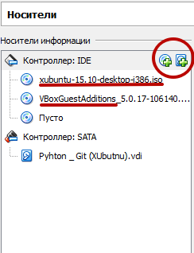
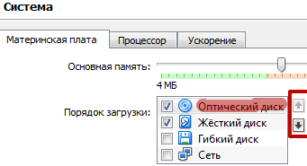
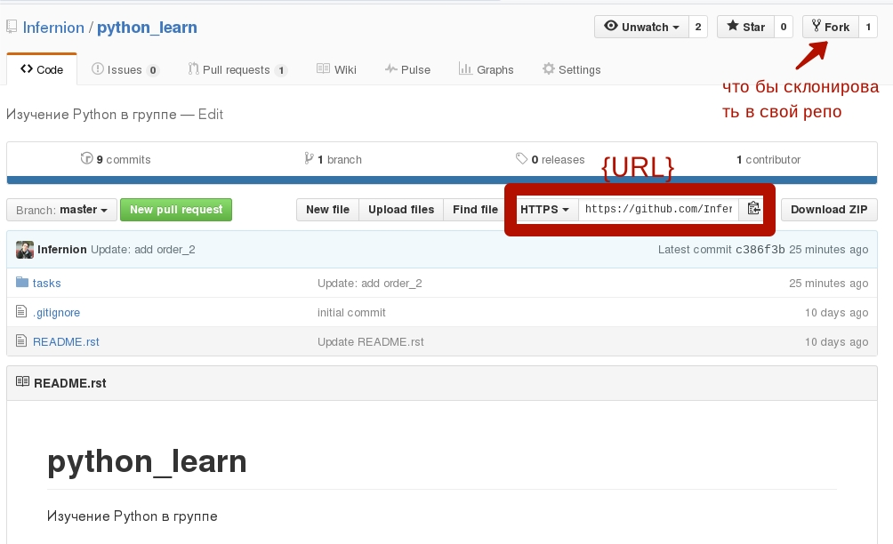
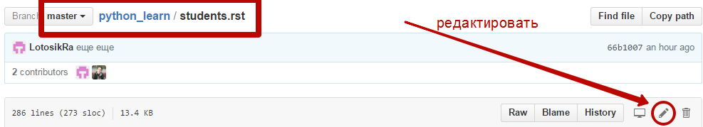
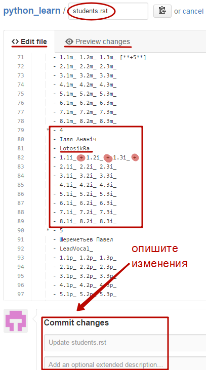

Установка Linux
================
Простая инструкция: webpage1_

Для работы в среде Linux требуеться установить на ПК виртуальную машину (download_). Там же загрузите Guest additions.
 После установки Oracle VM зайдите на webpage2_ для установки XUbuntu. Сайт предоставляет вам URL фдреса торентов,
 которые нужно скопировать в соотвествующее поле при запуске Торент-трекера с вашего ПК. Важно помнить куда загрузили
последние 2 файла.

Теперь открываем ВМ и создаём новую. Подходящие параметры узнать можно на картинках с webpage1_. Но в параметрах
"носители" нужно добавить зипки, используя кнопочку "добавить образ СД" и указав пути к ним.

А в параметрах "система" указать порядок загрузки следующий: сд - жесткий диск. Используйте кнопки справа.

Теперь запускаем образ Линукса и проходим простой процес установки. Подробнее: webpage1_
Когда установка заканчиваеться, выключаем машину (мирно) и извлекаем диск, удаляя ег ов параметрах "носители" (только
образ для установки).

Если хотим использовать функцию КопиПаст нужно в настройках параметра "общие" выбрать "двунаправленый" в "общий буфер
обмена" и "Drug'n'Drop". А в уже запущеном образе найти сверху (на панели программы) отверточку, нажать на неё и
запустится прочес установки GuestAdittions . После этого перезапустите образ и радуйтесь двустороннему буферу.

Чтобы установить SublimeText3 переходим there1_. Его настройка there2_
Установка PyCharm
=================

Установка Git
======================
1. создать аккаунт на `GitHub <https://github.com/join?source=header-home>`_.
2. прочитать про `Git <https://git-scm.com/book/ru/v1>`_. параграфы от  **Введение** до **Ветвление** включительно.
3. установить на свой компьютер `Git <https://git-scm.com/book/ru/v1/%D0%92%D0%B2%D0%B5%D0%B4%D0%B5%D0%BD%D0%B8%D0%B5-%D0%A3%D1%81%D1%82%D0%B0%D0%BD%D0%BE%D0%B2%D0%BA%D0%B0-Git>`_.
4. делаем форк моего репо себе

5. клонирем себе на компьютер репозиторием с которого вы сделали форк командой ``git clone url``, где url ссылка на ваш репозиторий. В ветке ``master`` будут задания.
Работа с репозиторием
=====================
1. переходим в склонированую папку ``python_learn`` командой ``cd python_learn``.
2. создайте ветку ``solutions`` где вы будете делать решения и заливать на GitHub, командой ``git branch solutions``. Детальнее о ветвлении в `Git <https://git-scm.com/book/ru/v1/%D0%92%D0%B5%D1%82%D0%B2%D0%BB%D0%B5%D0%BD%D0%B8%D0%B5-%D0%B2-Git>`_.
3. настраюем постоянную синхронизацию с моим репозиторием по статьям configuring-a-remote-for-a-fork_ и syncing-a-fork_. После правильной настройки у вас должен появится удаленный репозиторием ``upstream`` в котором будет хранится нынешняя версия моих изменений. Что бы обновлять репо выполните эту инструкцию syncing-a-fork_.
4. переходим в ветку ``solutions`` командой ``git checkout solutions`` и в папке ``tasks/`` решаем задания.
5. когда ваше решение проходит тесты то делаем ``git commit -m "Your message"`` и ``git push origin solutions``, что зальет изменения в ваш репозиторием
6. отправляем решения мне, для этого нужно сделать Pull_request_.
7. 'отмечаемся <https://github.com/Infernion/python_learn/blob/master/students.rst#Основы-python>'_

Работа с табличкой
==================
КАК РЕДАКТИРОВАТЬ
Наипростейший способ: сначала залить на сервер ветку solutions, а затем зайти на сайт и вручную
отредактировать. Для этого заходим к себе на репозиторий (https://github.com/'ваш_логин'/python_learn/blob/master)
 , выбираем файл students.rst Затем нажимаем кнопку "редактировать":

Теперь находим свою "колонку" и отмечаем плюсики " +" (пробел важен) напротив обновившихся (сделаных) заданий. Потом выбираем режим предпросмотра
и если всё хорошо (проверили работу ссылок, желательно открывать их в нвоом окне), то внизу делаем коммит с описанием.
На картинке снизу приведён пример:

При этом ссылки настроены изначально с учетом того, что вы добавляете решения в ветку "solutions".
Если вы используете другое название - отредактируйте свои ссылки.

.. Links

.. _webpage1: http://white55.ru/vboxubuntu.html
.. _download: https://www.virtualbox.org/wiki/Downloads
.. _webpage2: http://xubuntu.org/getxubuntu/#regular
.. _there1: http://ubuntovod.ru/soft/install-sublime-text-3.html
.. _there2: https://www.it-obzor.com/blog/aliev/delaem-iz-sublime-text-3-ide-dlya-python-i-django

.. _syncing-a-fork: https://help.github.com/articles/syncing-a-fork/#platform-windows
.. _configuring-a-remote-for-a-fork: https://help.github.com/articles/configuring-a-remote-for-a-fork/
.. _Pull_request: https://help.github.com/articles/using-pull-requests/
.. _for_comments: https://docs.google.com/drawings/d/1dPZvqznigTCSEu9PUpyOdQPVJq3bFfYVybETjvoTRoA/edit?usp=sharing
.. _scores: https://github.com/Infernion/python_learn/blob/master/students.rst#Основы-python